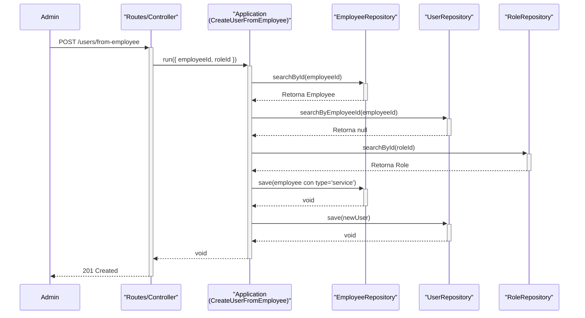

# Documentación de Flujos de Usuario

Este documento describe los flujos de negocio clave relacionados con la gestión de usuarios utilizando diagramas de Mermaid.

## Flujo: Crear un Usuario a partir de un Empleado (`CreateUserFromEmployee`)

Este diagrama de flujo describe el proceso que se sigue cuando un administrador "promociona" a un empleado existente para que se convierta en un usuario del sistema.

```mermaid
graph TD
    A[Inicio: Admin envía petición API<br>POST /users/from-employee<br>{ employeeId, roleId }] --> B{Controller};
    B --> C{1. ¿Es SuperAdmin?};
    C -- No --> D[Fin: Retorna 403 Forbidden];
    C -- Sí --> E[Ejecuta Caso de Uso<br>CreateUserFromEmployee];
    E --> F{2. ¿Existe el Empleado?};
    F -- No --> G[Fin: Retorna 404 Not Found<br>EmployeeDoesNotExistError];
    F -- Sí --> H{3. ¿Ya existe un Usuario<br>para este Empleado?};
    H -- Sí --> I[Fin: Retorna 400 Bad Request<br>InvalidArgumentError];
    H -- No --> J{4. ¿Existe el Rol?};
    J -- No --> K[Fin: Retorna 400 Bad Request<br>InvalidArgumentError];
    J -- Sí --> L[5. Actualiza el tipo de<br>empleado a 'service'];
    L --> M[6. Crea la entidad User<br>con contraseña generada];
    M --> N[7. Guarda el nuevo Usuario<br>en la Base de Datos];
    N --> O[Fin: Retorna 201 Created];
```

## Diagrama de Secuencia: `CreateUserFromEmployee`

Este diagrama muestra la interacción entre las diferentes capas de la arquitectura durante el mismo proceso.


